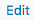

# Description

Here, you will find guidelines that can be applied in multiple places on the site.

## Editing a page

To get to edit a page you have two options, both of which will take you to the same place (editing the page):

#### A) From the `Pages`-menu

Click  on the left side of the Wordpress dashboard and then click edit in the box which looks like below (for whichever page you want to edit):

#### B) From the top bar's `Edit page` link

You also click  from the admin bar on the top when looking at the home page.

----

## Change page header content/image

Some pages have a header section, as per above. You can change the text by editing that pages (e.g. `News`) description:

The image, then, can be changed by changing the corresponding pages featured image:

----

## Creating a new piece of content (post/job/event/anything)

For creating a new piece of content (post/job/event/anything), you have once again two ways to do it:

#### A) From the corresponding content type's menu
Another option is to hover your mouse on the left over the corresponding content type's menu, and click `Add New`:

#### B) From the top bar's `New` dropdown menu

Hover your mouse over the `New` link in the top bar, and click the content type you want to add and you will be taken to creating a new piece of content of that specific type:

----

## Changing the menu links

If you for some reason want to change the links appearing on the navigation menu or to change their names, that is possible. The way to do that is to go from the Dashboard to  `->` 

Under `Menu Structure`, click the  on right of "Page" and you will see the information of that specific menu link.

###Change menu link name
By changing the `Navigation label`, you can change the name of the menu link:

###Delete menu link
By clicking  you can delete the link from the menu.

###Add menu link
By checking the page you want and clicking `Add to Menu`, the link you want will appear in the navigation.

###Reorder menu link
Just drag & drop the link up or down under `Menu Structure`.

---

## How do I reorder posts?
You can reorder posts of any type. Just go to the page listing those posts, and drag&drop them around in the list. You'll see a cursor like  when you can move a post.

---

## How do I hide a page / post?
Hiding a page/post is simple. When editing a post, you can see a  option. Click  and select "Private".

*!!!*: IF your page is listed in the navigation menu, you must also remember to remove it from there, too.

---

## How do I change the email address where feedback is sent?

Click 

Click 

Click :

Select the `Mail` tab:

Change the `To:` field:

Scroll down and click 
