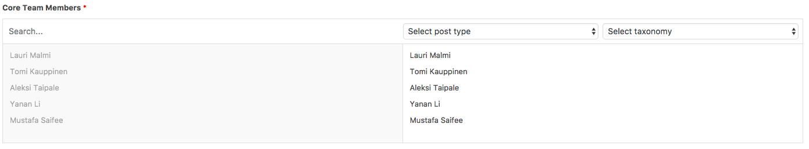
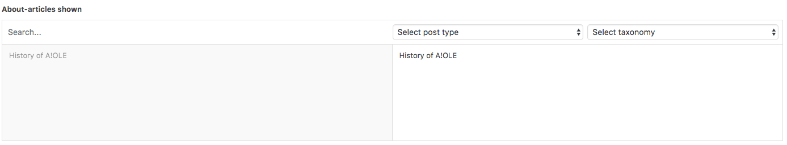
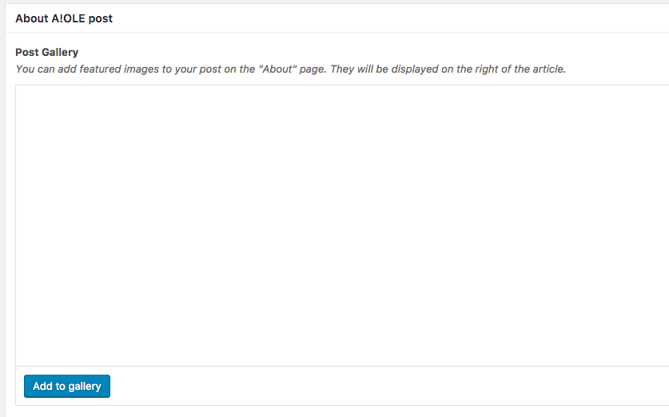

# Description

The about page shows three things: a brief description of what A!OLE is, a list of core team members and all the articles that have been categorized under "About".

---

## How to add/delete core team members?

Select the Team Members from the Core Team Members -selector shown below:

---

## How to add/delete an article to the About-page?

1. Select "About" as a category for your post
2. When editing the About-page, select the articles you want to be shown in the selector shown below:

---

## How do I add images to the articles on About-page?

When making a post with the `About`-category, you will have the option of adding max. 2 images to that specific article, as seen here:

