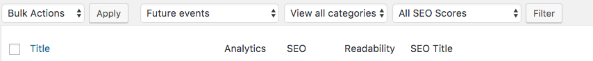
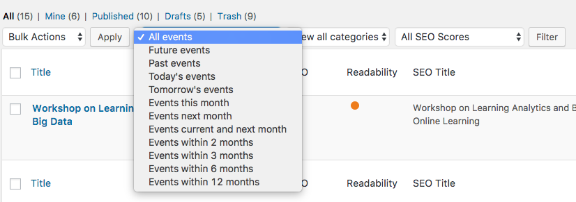
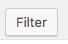
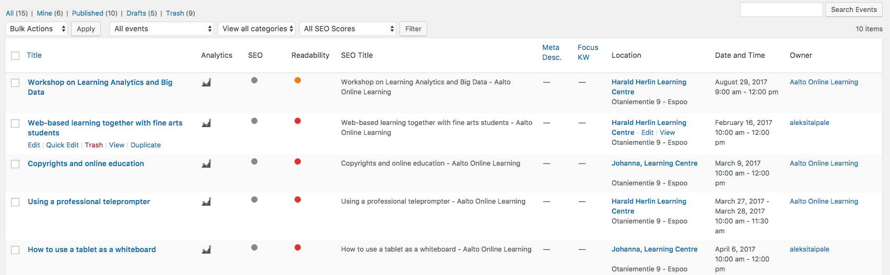
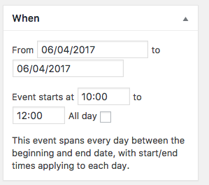
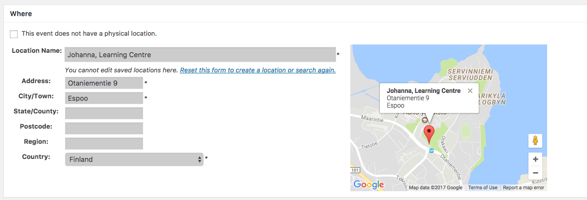
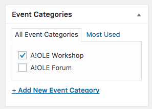
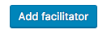
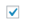

# Description

The events page lists all events, past and upcoming ones. It also contains a calendar that you can click to see a specific day's events. The calendar works automatically and is not changeable by the user.

---

## Why don't I see all events when adding a new event?

Sometimes, when adding a new event, you might be confused: why do you only see a part of your events? That is because the `Events`-list lists only future events by default. So you have to click the `Future events` dropdown:

and select what you want to see, f.ex. `All events`:

And click , and you will see your selection:

## Adding a new event

When making a new `Event`, there are some things you need to know.

### Event date & time

The event time is selected on the top right. Remember to recheck your months! The date selector is always in the current month by default.

### Event location
For the event location, you need a name, an Address and a City/Town (and a Country, but that should be Finland by default). The plugin saves previous locations, so you can try typing the first few letters to see if the location is there already and the form would autosuggest it (if somebody has used it previously).

### Event categories
Choose the event categories you want to use for your event.

### Featured image
Set a featured image for your event. Preferably `788x265`(low-resolution) or `1576x530`(high-resolution). If not possible, try to have a wide rectangular image: those display the best.

### Registration link
Just a http://google.com type of URL.
*How do I register to this event? If it's only for pilots, this link should probably lead to Inside instead of directly to the form. If it's a public event, you might as well link directly to the form (Doodle, Google Forms, whichever).*

### Adding facilitators
You can add multiple facilitators using the  button, or you can keep just one facilitator in.

*If the facilitator is a person: FIRSTNAME LASTNAME, Organization. E.g. JOHN DOE, Aalto University // If the facilitator is an organization: ORGANIZATION. e.g. AALTO ONLINE LEARNING*

### Only for pilots or not?

*Some A!OLE events are specifically for A!OLE pilots. Check this box if your event is only for pilots, leave it unchecked if it's for everyone.*

