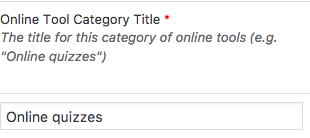
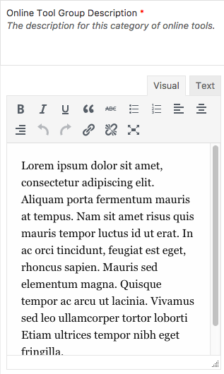
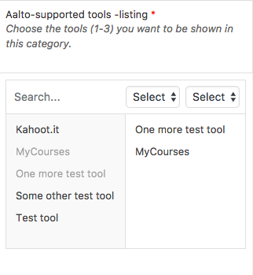
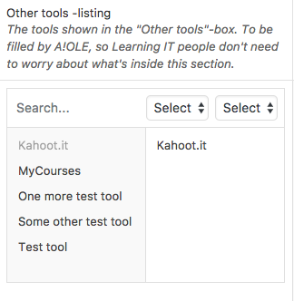
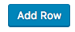

# Description

The guide to online learning describes online learning tools and what they are used for.

## What is Aalto Learning IT?

This section explains what Aalto Learning IT is. A title and a description, no more, no less.

## Online tool categories

In this part, you can create new `Online Tool Categories`, under which you can then add new `Online Learning Tools`. It's fairly simple.

Add the title here:

Add the description here:

And select the Aalto-supported tools here:

And the other tools here:

Click the  button if you want to add a new Online tool category.
