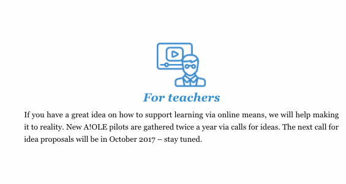
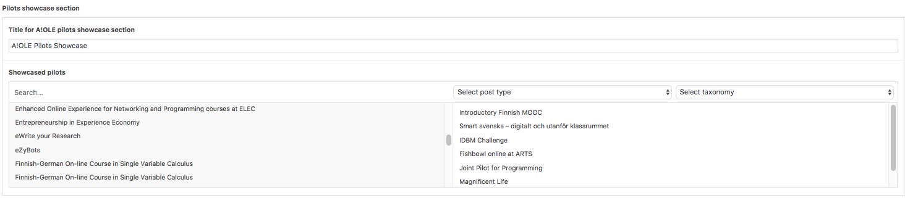
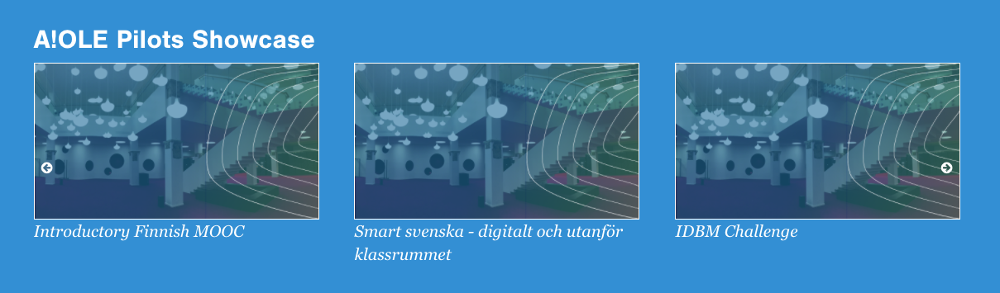

# Description
The home page is where the user first arrives when they come to the site. When editing the home page, you have quite a few things that you can edit on the page.

---

## Title

Editing the title won't change anything yet. For changing the navigation bar links, you have to change the navigation menu, as seen [here](general.md).

---

## Theta Image URL

This is the URL for the 360 degree image shown on the front page. It needs to be from the [Theta 360](https://theta360.com/) site to work.

*Keywords: 360, VR, Virtual Reality, Theta, 3D, viewer*

---

## What is A!OLE-content

corresponds to

*Keywords: front page text, homepage text*

---

## Email-form introduction

This corresponds to the email gathering form (that at the time of launch was hidden, hence no screenshot)

*Keywords: email form, subscription, e-mail*

---

## For teachers

corresponds to

## For all

corresponds to

*Keywords: for teachers, for all*

---

## Blog & news -Title
 corresponds to 

*Keywords: Feed title, blog title, blog, feed*

---

## Pilots showcase section

The pilots showcase allows you to choose as many pilots as you want from all the existing pilots in Wordpress. You can reorder the pilots by dragging & dropping their names on the right side selection box.

corresponds to

*Keywords: showcase, pilot showcase, pilots*

---
## Why online learning? -section

corresponds to

*Keywords: why online learning, changing educational culture, front page post*

---
## Why A!OLE? -section

corresponds to

