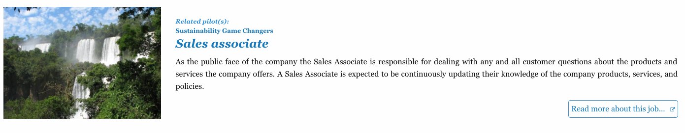
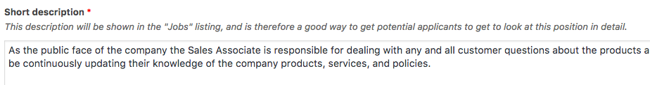
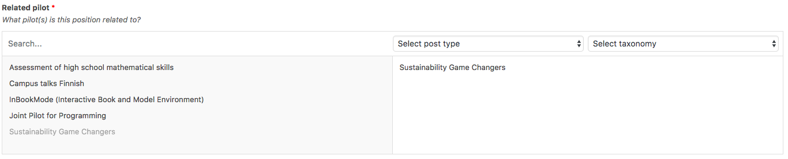

# Description

The Jobs page lists available jobs in A!OLE and A!OLE pilots. It's fairly simple: you add a new job. Add a featured image and a description. Then there are two Job-specific fields.

## Short description
The short description will be shown in the job listing, such as in here:

## Related pilot
What pilot is this job related to, if any? You can choose from the list and they will be displayed alongside the Job description.

