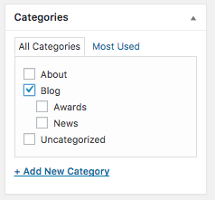

# Description

The news page is fairly straight-forward - it shows news articles. However, there's one thing you should know:

---

## How to add a post on the News-page

News-page shows all posts that belong in one or more of these categories: `Blog`, `News`, `Awards`. Hence, if you want to add a new News-post, you select one of these categories when creating a post. So, `New Post`, and then on the right you will find a categories box:

Select one or more of the aforementioned categories and you will see your post on the News page.

*Keywords: News article, blog post, blogpost, feed post*
