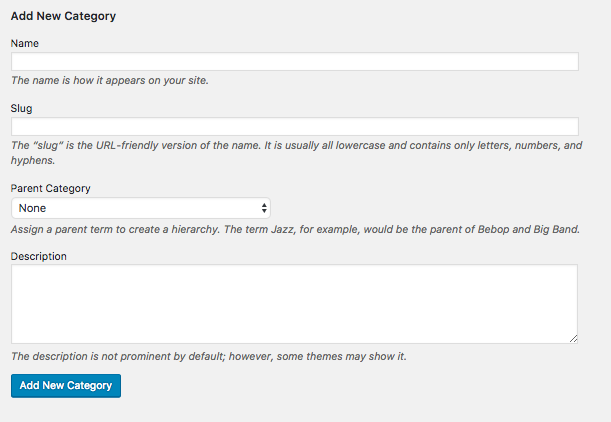
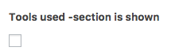

# Description

The pilots page gathers all the pilots in their respective Theme Groups.

## How do I add a Theme Group?

A Theme Group is added from  `->` . `-> Add New Category`:

---

*Keywords: Adding a theme group, new theme group*

## How do I put a pilot in a theme group?

When you edit a pilot page or create a new pilot page, you can see a `Theme Groups` box on the right side of the editing box. Select a theme from there:

Be wary, however: pilots can have multiple themes. If you want to change a theme, remember to uncheck the other one.

*Keywords: change theme, changing theme, put pilot to theme, pilot in theme*

---

## Adding a new pilot

You can add a new pilot as explained in [General](general.md). When adding a new pilot, there are some things that you need to include and some that are optional.

### Subtitle

The subtitle will be shown below the pilot title. It is not required but it is good for making the reader interested to read more about the pilot.

---

### Description

---

### People

---

### Tools used, Links & materials, Reflection
**Section is shown**

This setting decides whether the section in question is shown on this pilot page.

**Tools used / Links & materials / Reflection**
The content for the corresponding section.

---
